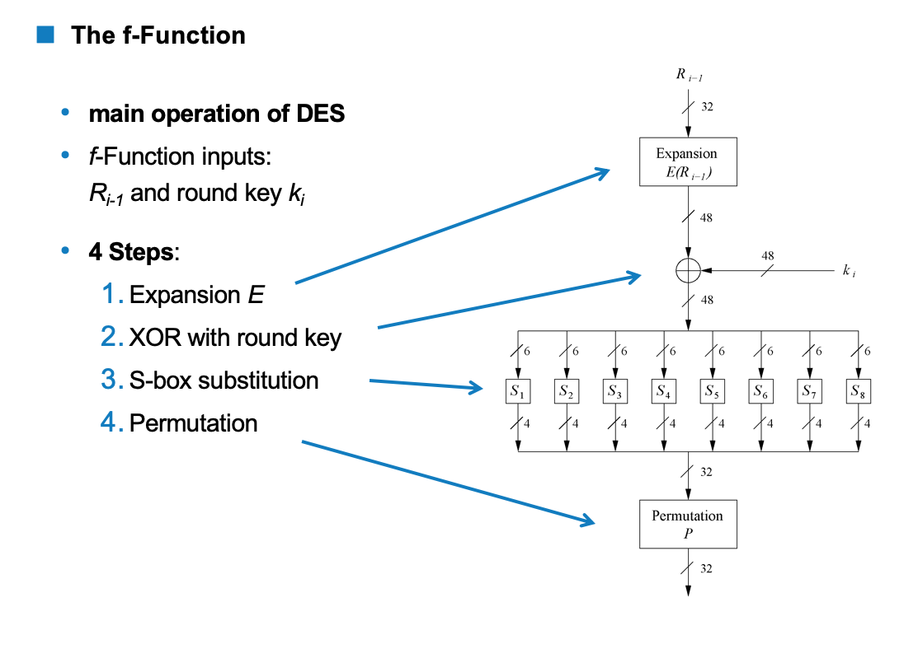

# Cryptography

###  Part B

1. Diffusion and confusion with example:

   Confusion: an encryption operation where the relationship between **key** and **ciphertext** is obscured. (substitution )

   Diffusion: an encryption  opeartion where the influnce of one **plaintext** symbol is spread over many ciphertext, the goal is hiding statical properties of the plaintext.  (bit permutation)

   111001   >> block cipher >> 101010

   101001   >> block cipher >> 000100

2. F- function steps

   

   1. Expansion E : increase diffusion.

   2. XOR Round Key: Bitwise XOR of the round key and the output of the expansion function E.

   3. S-box substitution: 

      * 8 substitution tables.
      * 6 bits input, 4 bits output: the 6 bit inputs: first and last one is to identify the row and the middle 4 bits for column.
      * Non-linear and resistant to differential cryptanalysis.
      * Crucial element for DES security.

   4. Permutaion P: 

      * bitwise permutation.
      * intriduces diffusion.
      * outpu of one S-box effect several S-Boxes in nest round.

      Diffusion by E, S-box and P guarantess that after round 5 every bit is a function of each key bit and each plaintext bit.

3. Hash function properties:

   1. 

      

   1. preimage resistance: for a given output z, it is impossible to find any input x such that  h(x) = z, h(x) is one-way function.
   2. second preimage resistance: given x1 and h(x1), it is computationally infeasible to find x2 such that h(x1) =h(x2).
   3. Collision resistance : it is computationally infeasible to find any pairs x != x2 such that h(x1) = h(x2).

4. AES expansion diagram:

5.  Main properties of digital signatures:

   * For a given message x, a digital signature is appended to the message (conventional signature).
   * Only person with private key should be able to generate the signature.
   * the signture must change for every document.
   * the signature is realzed as a function with the message x and private key as input.
   * the public key and the message x are the inputs to verfication.

## Practical

1. Caser Cipher: 
   * C = (p + k ) mod 26
   * P = (c - k ) mod 26
2. Playfiar:
   * key is 5x5 matrix choose a word then complete from the plain text if there is double occurance inner x.
   * ecnryption:
     * if both letter on the same row shift rigt
     * same column shift below.
     * not either take rectangle.
3. Polyalphabetic:
   * multiple cipher alphabetic.
   * Vegener cipher: multiple casear cipher.
   * key is the row and plain is the column.